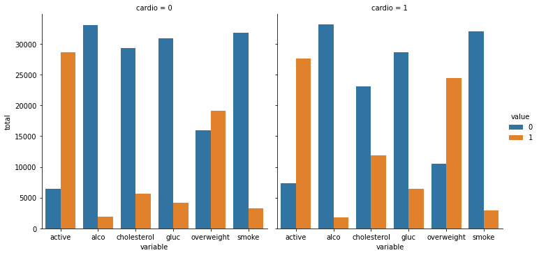
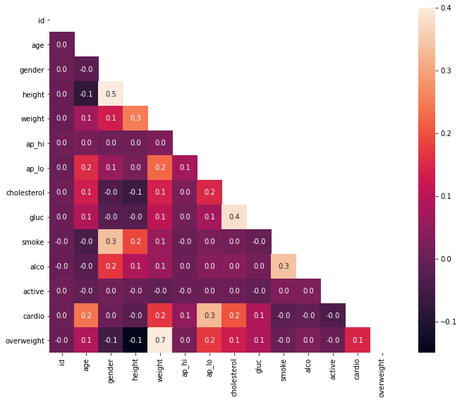

# Medical Data Visualizer

## Problem description

Content of this section is copied and reformatted from [this
repl.it](https://repl.it/github/freeCodeCamp/boilerplate-medical-data-visualizer),
provided by FCC
[here](https://www.freecodecamp.org/learn/data-analysis-with-python/data-analysis-with-python-projects/medical-data-visualizer).

### Assignment

In this project, you will visualize and make calculations from medical
examination data using matplotlib, seaborn, and pandas. The dataset values were
collected during medical examinations.

#### Data description

The rows in the dataset represent patients and the columns represent information
like body measurements, results from various blood tests, and lifestyle choices.
You will use the dataset to explore the relationship between cardiac disease,
body measurements, blood markers, and lifestyle choices.

File name: medical_examination.csv

|                    Feature                    |    Variable Type    |  Variable   |                    Value Type                    |
| :-------------------------------------------: | :-----------------: | :---------: | :----------------------------------------------: |
|                      Age                      |  Objective Feature  |     age     |                    int (days)                    |
|                    Height                     |  Objective Feature  |   height    |                     int (cm)                     |
|                    Weight                     |  Objective Feature  |   weight    |                    float (kg)                    |
|                    Gender                     |  Objective Feature  |   gender    |                 categorical code                 |
|            Systolic blood pressure            | Examination Feature |    ap_hi    |                       int                        |
|           Diastolic blood pressure            | Examination Feature |    ap_lo    |                       int                        |
|                  Cholesterol                  | Examination Feature | cholesterol | 1: normal, 2: above normal, 3: well above normal |
|                    Glucose                    | Examination Feature |    gluc     | 1: normal, 2: above normal, 3: well above normal |
|                    Smoking                    | Subjective Feature  |    smoke    |                      binary                      |
|                Alcohol intake                 | Subjective Feature  |    alco     |                      binary                      |
|               Physical activity               | Subjective Feature  |   active    |                      binary                      |
| Presence or absence of cardiovascular disease |   Target Variable   |   cardio    |                      binary                      |

#### Tasks

Create a chart similar to `examples/Figure_1.png`, where we show the counts of
good and bad outcomes for the `cholesterol`, `gluc`, `alco`, `active`, and
`smoke` variables for patients with cardio=1 and cardio=0 in different panels.

Use the data to complete the following tasks in `medical_data_visualizer.py`:

- Add an `overweight` column to the data. To determine if a person is
  overweight, first calculate their BMI by dividing their weight in kilograms by
  the square of their height in meters. If that value is > 25 then the person is
  overweight. Use the value 0 for NOT overweight and the value 1 for overweight.
- Normalize the data by making 0 always good and 1 always bad. If the value of
  `cholesterol` or `gluc` is 1, make the value 0. If the value is more than 1,
  make the value 1.
- Convert the data into long format and create a chart that shows the value
  counts of the categorical features using seaborn's `catplot()`. The dataset
  should be split by 'Cardio' so there is one chart for each `cardio` value. The
  chart should look like `examples/Figure_1.png`.
- Clean the data. Filter out the following patient segments that represent
  incorrect data:
  - diastolic pressure is higher than systolic (Keep the correct data with
    `(df['ap_lo'] <= df['ap_hi'])`)
  - height is less than the 2.5th percentile (Keep the correct data with
    `(df['height'] >= df['height'].quantile(0.025))`)
  - height is more than the 97.5th percentile
  - weight is less than the 2.5th percentile
  - weight is more than the 97.5th percentile
- Create a correlation matrix using the dataset. Plot the correlation matrix
  using seaborn's `heatmap()`. Mask the upper triangle. The chart should look
  like `examples/Figure_2.png`.

Any time a variable is set to `None`, make sure to set it to the correct code.

## Note

This is cool. But I guess I prefer to visualize data with d3, it feels more
easier to me. We can also get some interactive charts instead of static
images.

Total time: 2h

Damn, why can't I be faster, it's only about Google and reading document

## Solution


```python
import pandas as pd
import seaborn as sns
import matplotlib as mpl
import matplotlib.pyplot as plt
import numpy as np
```

### Import data


```python
df = pd.read_csv("./medical_examination.csv")
```

### Add 'overweight' column


```python
df["overweight"] = np.where(
    df["weight"] / (df["height"] * df["height"]) * 10000 > 25,
    1,
    0,
)
```

Normalize data by making 0 always good and 1 always bad. If the value of
'cholesterol' or 'gluc' is 1, make the value 0. If the value is more than 1,
make the value 1.


```python
df["cholesterol"] = np.where(df["cholesterol"] == 1, 0, 1)
df["gluc"] = np.where(df["gluc"] == 1, 0, 1)
```

### Draw Categorical Plot


```python
def draw_cat_plot():
    # Create DataFrame for cat plot using `pd.melt` using just the values from
    # 'cholesterol', 'gluc', 'smoke', 'alco', 'active', and 'overweight'.
    vars = sorted(
        ["cholesterol", "gluc", "smoke", "alco", "active", "overweight"]
    )

    df_cat = pd.melt(
        df,
        id_vars=["cardio"],
        value_vars=vars,
    )

    # Group and reformat the data to split it by 'cardio'. Show the counts of
    # each feature. You will have to rename one of the columns for the catplot
    # to work correctly.
    df_cat = df_cat.value_counts().reset_index(name="total")

    # Draw the catplot with 'sns.catplot()'
    fig = sns.catplot(
        data=df_cat,
        x="variable",
        y="total",
        hue="value",
        col="cardio",
        kind="bar",
        order=vars,
    )
    fig.set_ylabels("total")
    fig.set_xlabels("variable")
    fig = fig.fig

    # Do not modify the next two lines
    # fig.savefig("catplot.png") # Don't save to file
    return fig
```

### Draw Heat Map


```python
def draw_heat_map():
    # Clean the data
    df_heat = df.loc[
        (df["ap_lo"] <= df["ap_hi"])
        & (df["height"] >= df["height"].quantile(0.025))
        & (df["height"] <= df["height"].quantile(0.975))
        & (df["weight"] >= df["weight"].quantile(0.025))
        & (df["weight"] <= df["weight"].quantile(0.975))
    ]

    # Calculate the correlation matrix
    corr = df_heat.corr()

    # Generate a mask for the upper triangle
    mask = np.zeros_like(corr)
    mask[np.triu_indices_from(mask)] = True

    # Set up the matplotlib figure
    # with sns.axes_style("white"):
    fig, ax = plt.subplots(figsize=(12, 9))

    # Draw the heatmap with 'sns.heatmap()'
    ax = sns.heatmap(
        corr,
        mask=mask,
        vmax=0.4,
        square=True,
        fmt=".1f",
        annot=True,
    )

    # Do not modify the next two lines
    # fig.savefig("heatmap.png")
    # Don't save to file
    return fig
```

## Test


```python
import unittest
```


```python
class CatPlotTestCase(unittest.TestCase):
    def setUp(self):
        self.fig = draw_cat_plot()
        self.ax = self.fig.axes[0]

    def test_line_plot_labels(self):
        actual = self.ax.get_xlabel()
        expected = "variable"
        self.assertEqual(
            actual, expected, "Expected line plot xlabel to be 'variable'"
        )
        actual = self.ax.get_ylabel()
        expected = "total"
        self.assertEqual(
            actual, expected, "Expected line plot ylabel to be 'total'"
        )
        actual = []
        for label in self.ax.get_xaxis().get_majorticklabels():
            actual.append(label.get_text())
        expected = [
            "active",
            "alco",
            "cholesterol",
            "gluc",
            "overweight",
            "smoke",
        ]
        self.assertEqual(
            actual,
            expected,
            "Expected bar plot secondary x labels to be 'active', 'alco', 'cholesterol', 'gluc', 'overweight', 'smoke'",
        )

    def test_bar_plot_number_of_bars(self):
        actual = len(
            [
                rect
                for rect in self.ax.get_children()
                if isinstance(rect, mpl.patches.Rectangle)
            ]
        )
        expected = 13
        self.assertEqual(
            actual, expected, "Expected a different number of bars chart."
        )
```


```python
class HeatMapTestCase(unittest.TestCase):
    def setUp(self):
        self.fig = draw_heat_map()
        self.ax = self.fig.axes[0]

    def test_heat_map_labels(self):
        actual = []
        for label in self.ax.get_xticklabels():
            actual.append(label.get_text())
        expected = [
            "id",
            "age",
            "gender",
            "height",
            "weight",
            "ap_hi",
            "ap_lo",
            "cholesterol",
            "gluc",
            "smoke",
            "alco",
            "active",
            "cardio",
            "overweight",
        ]
        self.assertEqual(
            actual,
            expected,
            "Expected bar plot legend labels to be months of the year.",
        )

    def test_heat_map_values(self):
        actual = [
            text.get_text()
            for text in self.ax.get_default_bbox_extra_artists()
            if isinstance(text, mpl.text.Text)
        ]
        print(actual)
        expected = [
            "0.0",
            "0.0",
            "-0.0",
            "0.0",
            "-0.1",
            "0.5",
            "0.0",
            "0.1",
            "0.1",
            "0.3",
            "0.0",
            "0.0",
            "0.0",
            "0.0",
            "0.0",
            "0.0",
            "0.2",
            "0.1",
            "0.0",
            "0.2",
            "0.1",
            "0.0",
            "0.1",
            "-0.0",
            "-0.1",
            "0.1",
            "0.0",
            "0.2",
            "0.0",
            "0.1",
            "-0.0",
            "-0.0",
            "0.1",
            "0.0",
            "0.1",
            "0.4",
            "-0.0",
            "-0.0",
            "0.3",
            "0.2",
            "0.1",
            "-0.0",
            "0.0",
            "0.0",
            "-0.0",
            "-0.0",
            "-0.0",
            "0.2",
            "0.1",
            "0.1",
            "0.0",
            "0.0",
            "0.0",
            "0.0",
            "0.3",
            "0.0",
            "-0.0",
            "0.0",
            "-0.0",
            "-0.0",
            "-0.0",
            "0.0",
            "0.0",
            "-0.0",
            "0.0",
            "0.0",
            "0.0",
            "0.2",
            "0.0",
            "-0.0",
            "0.2",
            "0.1",
            "0.3",
            "0.2",
            "0.1",
            "-0.0",
            "-0.0",
            "-0.0",
            "-0.0",
            "0.1",
            "-0.1",
            "-0.1",
            "0.7",
            "0.0",
            "0.2",
            "0.1",
            "0.1",
            "-0.0",
            "0.0",
            "-0.0",
            "0.1",
        ]
        self.assertEqual(
            actual, expected, "Expected differnt values in heat map."
        )
```


```python
if __name__ == "__main__":
    unittest.main(argv=["first-arg-is-ignored"], exit=False)
```

    ....
    ----------------------------------------------------------------------
    Ran 4 tests in 1.222s
    
    OK


    ['0.0', '0.0', '-0.0', '0.0', '-0.1', '0.5', '0.0', '0.1', '0.1', '0.3', '0.0', '0.0', '0.0', '0.0', '0.0', '0.0', '0.2', '0.1', '0.0', '0.2', '0.1', '0.0', '0.1', '-0.0', '-0.1', '0.1', '0.0', '0.2', '0.0', '0.1', '-0.0', '-0.0', '0.1', '0.0', '0.1', '0.4', '-0.0', '-0.0', '0.3', '0.2', '0.1', '-0.0', '0.0', '0.0', '-0.0', '-0.0', '-0.0', '0.2', '0.1', '0.1', '0.0', '0.0', '0.0', '0.0', '0.3', '0.0', '-0.0', '0.0', '-0.0', '-0.0', '-0.0', '0.0', '0.0', '-0.0', '0.0', '0.0', '0.0', '0.2', '0.0', '-0.0', '0.2', '0.1', '0.3', '0.2', '0.1', '-0.0', '-0.0', '-0.0', '-0.0', '0.1', '-0.1', '-0.1', '0.7', '0.0', '0.2', '0.1', '0.1', '-0.0', '0.0', '-0.0', '0.1']








